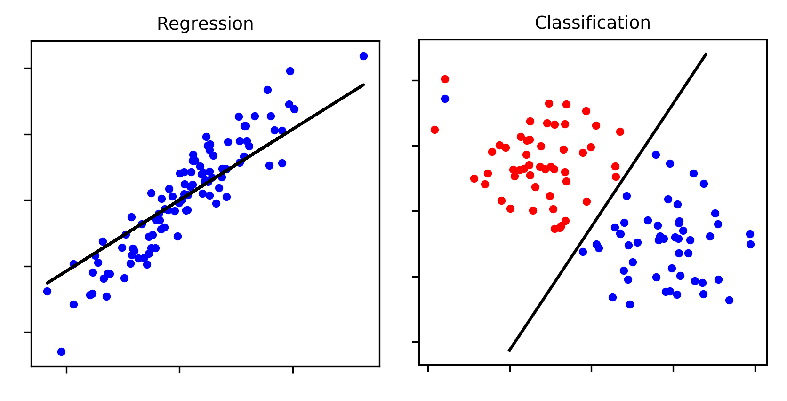
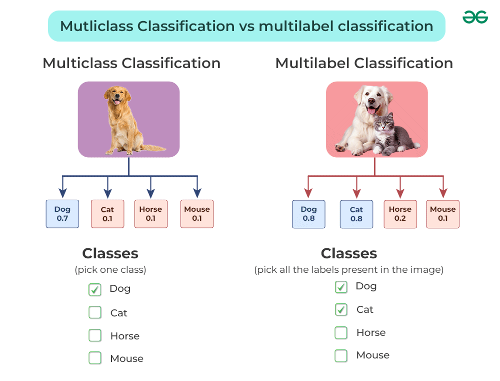
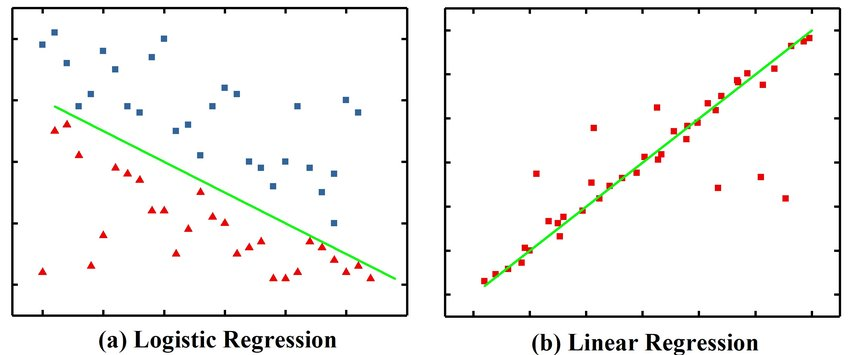
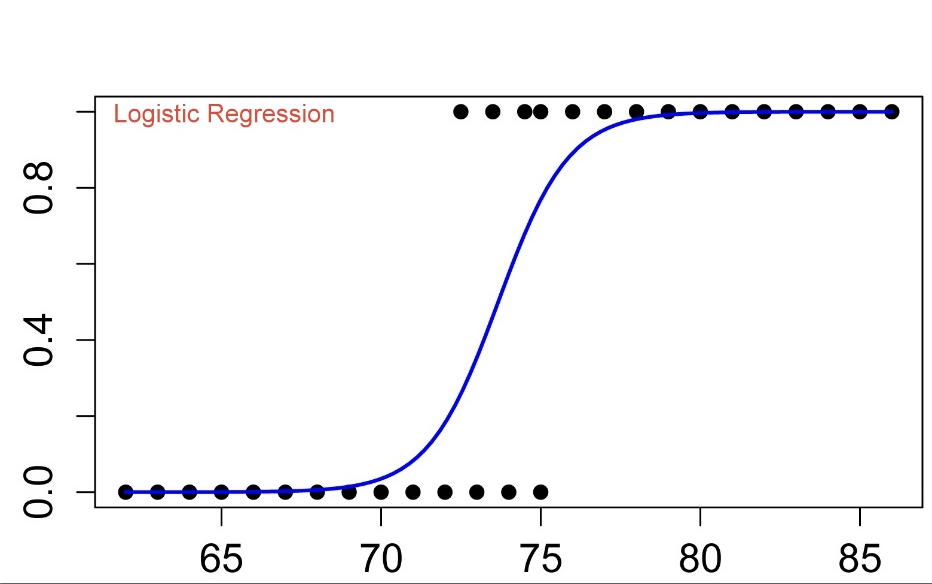
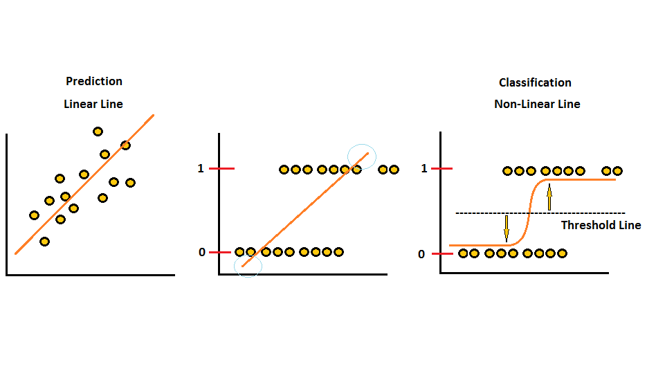
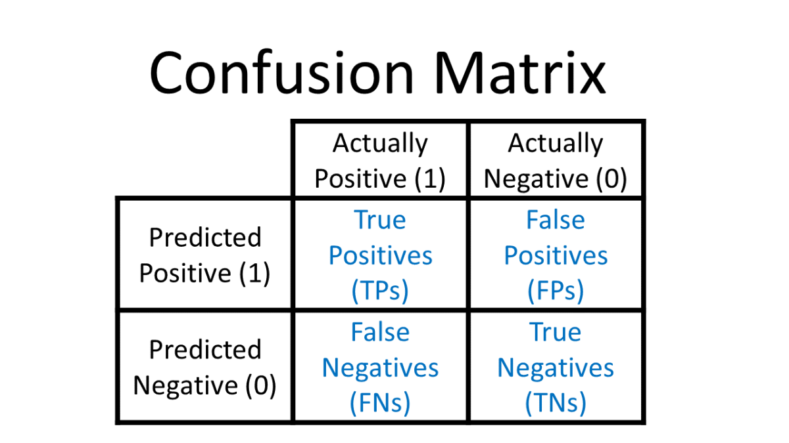
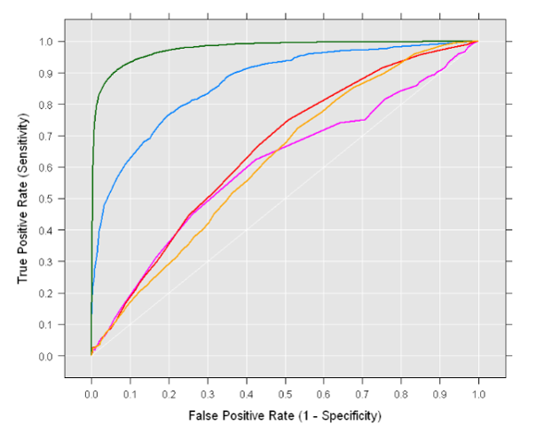

## **Classification**
- **Classification is a supervised learning concept which basically categorizes a set of data into classes.**

**Classification can be categorized into several types based on different criteria. Here are some common types of classification:**
1. **Binary Classification:** 
    - This type of classification involves sorting items into two categories or classes. 
    - For example, determining whether an email is spam or not spam, or classifying whether a patient has a particular disease or not.

2. **Multi-class Classification:** 
    - In multi-class classification, items are sorted into more than two categories. 
    - For instance, classifying images of animals into categories such as dog, cat, or bird.

3. **Multi-label Classification:** 
    - Unlike multi-class classification, where each item is assigned to only one class, multi-label classification allows items to belong to multiple classes simultaneously. 
    - For example, classifying news articles into topics like politics, sports, and entertainment, where an article can belong to more than one category.

## **Logistic Regression**
- **Logistic Regression is a statistical method used for binary classification tasks, where the goal is to predict the probability that an observation belongs to one of two classes.**

- **Despite its name, logistic regression is a classification algorithm rather than a regression algorithm.**

- **Logistic regression models the relationship between one or more independent variables (features) and a binary dependent variable (the outcome or class).**

- **It assumes a linear relationship between the independent variables and the logarithm of the odds of the dependent variable.**

- **The logistic function, also known as the sigmoid function, is used to map the output of the linear combination of features to a value between 0 and 1.**

### **Linear Regression VS Logist Regression**
- **Linear Regression:** 
    - Linear regression is used for predicting continuous numeric outcomes. It models the relationship between one or more independent variables (predictors) and a continuous dependent variable (response).
    - The dependent variable in linear regression is continuous and can take any value within a range. For example, predicting house prices, temperature, or sales volume.
    - The output of linear regression is a continuous value. It could be any real number within the range defined by the data.

- **Logistic Regression:** 
    - Logistic regression is used for predicting the probability of a binary categorical outcome. It models the relationship between one or more independent variables and a binary dependent variable (0 or 1, true or false).
    - The dependent variable in logistic regression is binary and represents probabilities or proportions. It typically represents a categorical outcome, such as whether an email is spam or not spam, whether a patient has a disease or not, etc.
    - The output of logistic regression is a probability value between 0 and 1, representing the likelihood or probability of belonging to a particular class.

### **Logistic/Sigmoid Function**
- The sigmoid function, is a mathematical function that maps any real-valued number to a value between 0 and 1. 
- It is commonly used in logistic regression to model the probability of a binary outcome.
$$g(z)= \frac{1}{1+e^{-z}}$$

- Hypothesis: $ℎ_θ(𝑥) = \frac{1}{1+𝑒^{-(θ_0+θ_1 𝑋_1+…+θ_𝑛 𝑋_𝑛 )}}$
- Parameters: $θ_0, θ_1, …, θ_𝑛$
- Cost function: $J(\theta) = -\frac{1}{m} \sum_{i=1}^{m} \left[ y^{(i)} \log(h_{\theta}(x^{(i)})) + (1 - y^{(i)}) \log(1 - h_{\theta}(x^{(i)})) \right]$
- Goal: minimize $J(\theta)$
$$\theta := \theta - \alpha \cdot \frac{1}{m} \sum_{i=1}^{m} \left( h_{\theta}(x^{(i)}) - y^{(i)} \right) \cdot x^{(i)}$$

- Hypothesis: $y = \frac{1}{1+𝑒^{-(θ_0+θ_1 𝑋_1+…+θ_𝑛 𝑋_𝑛 )}}$
- Parameters: $θ_0, θ_1, …, θ_𝑛$
- Cost function: $J(\theta) = -\frac{1}{m} \sum_{i=1}^{m} \left[ \hat{y}^{(i)} \log((y^{(i)})) + (1 - y^{(i)}) \log(1 - (\hat{y}^{(i)})) \right]$
- Goal: minimize $J(\theta)$
$$\theta := \theta - \alpha \cdot \frac{1}{m} \sum_{i=1}^{m} \left( (\hat{y}^{(i)}) - y^{(i)} \right) \cdot x^{(i)}$$
#### **Example**
- Let's consider a binary classification problem where we want to predict whether a given email is spam (1) or not spam (0) based on the length of the email subject line. 
- We have a dataset containing the following observations:

    |Email Subject Length (x) |	Spam (y)|
    |-------------------------|---------|
    |           2	          |    0    |
    |           3	          |    0    |
    |	        4	          |    0    |
    |	        5	          |    1    |
    |   	    6	          |	   1    |
    |           7             |    1    |

- We initialize the parameters with random values or zeros. Let's set them to $θ_0=0$ and $θ_1=0$.
- Hypothesis: $ℎ_θ(𝑥) = \frac{1}{1+𝑒^{-(θ_0+θ_1 𝑋_1)}}$
- Parameters: $θ_0, θ_1$
- Cost function: $J(\theta) = -\frac{1}{m} \sum_{i=1}^{m} \left[ y^{(i)} \log(h_{\theta}(x^{(i)})) + (1 - y^{(i)}) \log(1 - h_{\theta}(x^{(i)})) \right]$
- Goal: minimize $J(\theta)$

**Solving**
- Calculate $g(z)$

$$z = θ_0 + θ_1⋅X$$
$$z = 0+0⋅[2,3,4,5,6,7]$$
$$z = [0,0,0,0,0,0]$$

$$g(z)= \frac{1}{1+e^{-z}}$$
$$g(z)= \frac{1}{1+e^{-[0,0,0,0,0,0]}}$$
$$g(z)= \frac{1}{[1]+[1,1,1,1,1,1]}$$
$$g(z)=[0.5,0.5,0.5,0.5,0.5,0.5]$$

- Compute the cost function $J(θ)$:
$$J(\theta) = -\frac{1}{m} \sum_{i=1}^{m} \left[ y^{(i)} \log(h_{\theta}(x^{(i)})) + (1 - y^{(i)}) \log(1 - h_{\theta}(x^{(i)})) \right]$$
$$= -\frac{1}{6} \left[ 0 * \log(0.5) + (1 - 0) \log(1 - 0.5) \right] = -\frac{1}{6} \left[\log(0.5) \right]$$
$$+$$
$$= -\frac{1}{6} \left[ 0 * \log(0.5) + (1 - 0) \log(1 - 0.5) \right] = -\frac{1}{6} \left[\log(0.5) \right]$$
$$+$$
$$= -\frac{1}{6} \left[ 0 * \log(0.5) + (1 - 0) \log(1 - 0.5) \right] = -\frac{1}{6} \left[\log(0.5) \right]$$
$$+$$
$$= -\frac{1}{6} \left[ 1 * \log(0.5) + (1 - 1) \log(1 - 0.5) \right] = -\frac{1}{6} \left[\log(0.5) \right]$$
$$+$$
$$= -\frac{1}{6} \left[ 1 * \log(0.5) + (1 - 1) \log(1 - 0.5) \right] = -\frac{1}{6} \left[\log(0.5) \right]$$
$$+$$
$$= -\frac{1}{6} \left[ 1 * \log(0.5) + (1 - 1) \log(1 - 0.5) \right] = -\frac{1}{6} \left[\log(0.5) \right]$$
$$J(\theta) = - \log(0.5)$$

- **Update Parameters:**

​$$\theta := \theta - \alpha \cdot \frac{1}{m} \sum_{i=1}^{m} \left( h_{\theta}(x^{(i)}) - y^{(i)} \right) \cdot x^{(i)}$$
$$θ_0:=0−0.01×\frac{1}{6}×0.5×[2+3+4+5+6+7]=−0.005$$
$$θ_1:=0−0.01× \frac{1}{6}×0.5×27​=−0.0225$$

- **Repeat to get the best results**
-------------------------------------
## **Classification Metrics**
#### **Confusion Matrix**
- A confusion matrix is a table that is often used to describe the performance of a classification model on a set of test data for which the true values are known.
- It is a matrix with four different combinations of predicted and actual classes: true positive (TP), true negative (TN), false positive (FP), and false negative (FN).
- It helps to understand the performance of the classification algorithm and to identify areas for improvement.

#### **Accuracy**
- Accuracy measures the proportion of correctly classified instances among all instances.
- It is calculated as the ratio of the number of correct predictions (TP + TN) to the total number of predictions (TP + TN + FP + FN).
- While accuracy is a widely used metric, it may not be the best choice when the classes are imbalanced.
$$\text{Accuracy} = \frac{\text{True Positives (TP)} + \text{True Negatives (TN)}}{\text{Total Population}}$$
#### **Precision**
- Precision measures the proportion of true positive predictions among all positive predictions made by the classifier.
- It is calculated as the ratio of true positives (TP) to the sum of true positives and false positives (FP).
- Precision indicates how many of the predicted positive instances are actually positive.
$$\text{Precision} = \frac{\text{True Positives (TP)}}{\text{True Positives (TP)} + \text{False Positives (FP)}}$$
#### **Recall**
- Recall, also known as sensitivity or true positive rate (TPR), measures the proportion of actual positive instances that are correctly identified by the classifier.
- It is calculated as the ratio of true positives (TP) to the sum of true positives and false negatives (FN).
- Recall indicates how many of the actual positive instances were captured by the classifier.
$$\text{Recall} = \frac{\text{True Positives (TP)}}{\text{True Positives (TP)} + \text{False Negatives (FN)}}$$
#### **F1-Score**
- The F1 score is the harmonic mean of precision and recall.
- It provides a balance between precision and recall and is particularly useful when the classes are imbalanced.
$$\text{F1 Score} = 2 \times \frac{\text{Precision} \times \text{Recall}}{\text{Precision} + \text{Recall}}$$
#### **ROC Curve (Receiver Operating Characteristic Curve)**
- The ROC curve is a graphical representation of the trade-off between the true positive rate (sensitivity) and the false positive rate (1 - specificity) across different threshold values.
- It plots the true positive rate (TPR) against the false positive rate (FPR) at various threshold settings.
- The diagonal line (y = x) represents the random classifier.
- A better classifier is one that curves towards the top
- -left corner of the plot, indicating higher true positive rate and lower false positive rate.
- The ROC curve helps to visualize the classifier's performance across various threshold settings and to choose the optimal threshold based on the specific problem requirements.
- #### **Area Under Curve (AUC)**
- The Area Under Curve (AUC) measures the entire two-dimensional area underneath the ROC curve.
- It provides a single scalar value that summarizes the overall performance of a classifier across all possible threshold settings.
- A perfect classifier has an AUC score of 1, indicating that it achieves perfect separation between positive and negative instances.
- A classifier that performs no better than random guessing has an AUC score of 0.5, resulting in the diagonal line (y = x) in the ROC curve.
- AUC is a commonly used metric for comparing different classifiers or evaluating the robustness of a classifier to varying threshold values.

------------------------------
### **Logistic Regression for multi-class classification**
- Logistic Regression is primarily a binary classification algorithm, meaning it's designed to classify instances into two classes. 
- However, it can be extended to handle multi-class classification problems through various techniques. 
- One common approach is the **"one-vs-rest" (OvR)** or **"one-vs-one"** strategy, where you train multiple binary logistic regression classifiers, each one against one of the classes, and then combine their results.

- **This function ensures that the predicted probabilities are within the range [0, 1].The logistic (sigmoid) function is represented as:**
$$g(z)= \frac{1}{1+e^{-z}}$$
